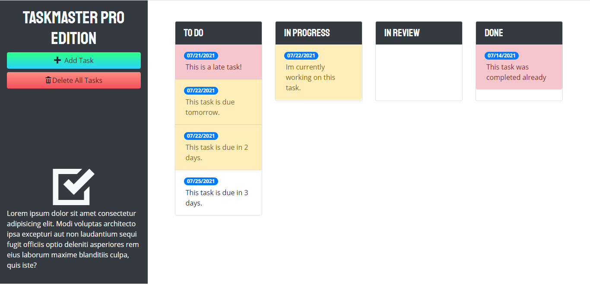
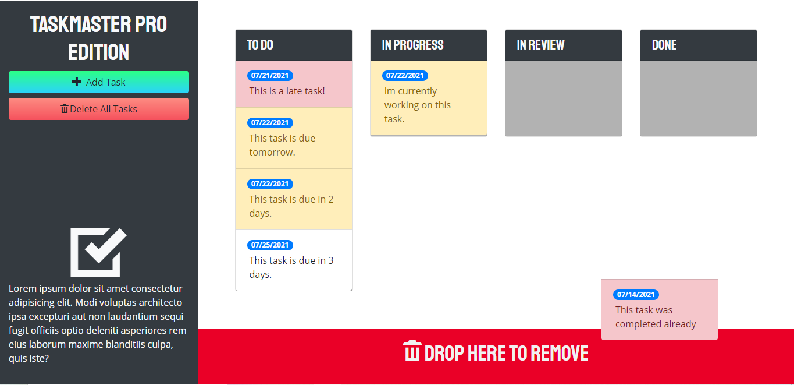

# Luiz Guilherme Padredi

# Taskmaster Pro Edition :pencil:

## :label: Description
A very friendly and interactive program for a user to organize their tasks by date and keep track of their deadlines.

## :scroll: Instructions
Add tasks, edit tasks, drag the tasks through the different columns and status, and delete tasks.

## 	:hash: Built With
:heavy_check_mark: HTML 
:heavy_check_mark: CSS 
:heavy_check_mark: JavaScript 
:heavy_check_mark: jQuery 
:heavy_check_mark: Bootstrap

## :desktop_computer: Website
Link to Website: https://padredilg.github.io/taskmaster-pro/
  
Screenshot from Website:

## :clap: Credits

:hammer_and_wrench: Created by Luiz Guilherme Padredi
